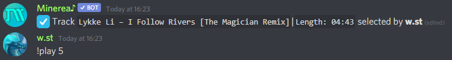
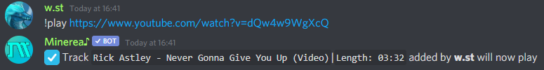

# Playing music


Basic prefix of Minerea is `!`  
It can be changed by [following this guide](../general-info/changing-config.md#setting-prefix)

Minerea always use mention as prefix  
Example: `@Minerea♪#1461 play`



You need to be in voice channel to order music


## Playing through searching

Type in text channel

* !play `song name`

Bot will give you list of 10 songs, select any with

* !play `number from list` or `!number from list`

## Playing through link

Type in text channel 

* !play `link to song`

[**List of all supported sources**](../general-info/supported-music-sources.md)\*\*\*\*

