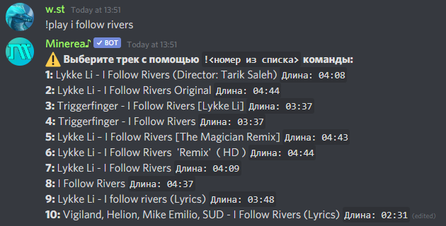
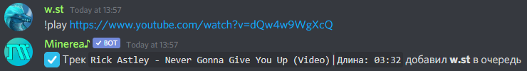

# Воспроизведение музыки


Базовый префикс Minerea `!`  
Его можно изменить, следуя [этому руководству](../general-info/changing-config.md#izmenenie-prefiksa)

Minerea всегда использует упоминание в качестве префикса  
Пример: `@Minerea♪#1461 play`



Чтобы запросить трек, вам нужно быть в голосовом канале


## Запрос трека через поиск

Введите в текстовый канал

* !play `название трека`

Бот выдаст вам список из 10 песен, выберите любую с помощью

* !play `номер из списка` или `!номер из списка`

## Запрос трека через ссылку

Введите в текстовом канале

* !play `ссылка на трек`

[**Список всех платформ откуда бот может воспроизводить треки**](../general-info/supported-music-sources.md)\*\*\*\*

