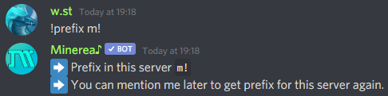
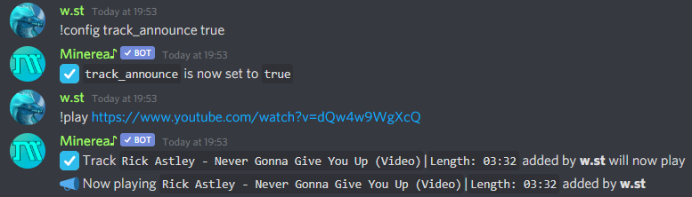

# Changing config

## Setting prefix

Default prefix in Minerea is `!` you can always change it to any other

For example

* !prefix `m!`

Now all commands works with `m!` prefix


You can mention Minerea and it show current prefix in your server



Help command always can be called through default `!` prefix


## Setting language

Minerea can speak on many languages, here list of currently supported

* `en_US` - English \(Default language if server region is not setted to Russia\)
* `ru_RU` - Русский
* `cs_CZ` - Česky
* `it_IT` - Italiano

For example

* !lang `en_US`

Now all responses to commands will be in English language

## Setting track announce

Track announce setting showing info about current playing music when it starting

Here example how to turn on or turn off this feature



!config `track_announce true`



!config `track_announce false`



## Setting auto resume

Auto resume setting does what the title says, it automatically resuming current music when someone is joining channel where bot

Here example how to turn on or turn off this feature



!config `auto_resume true`



!config `auto_resume false`



