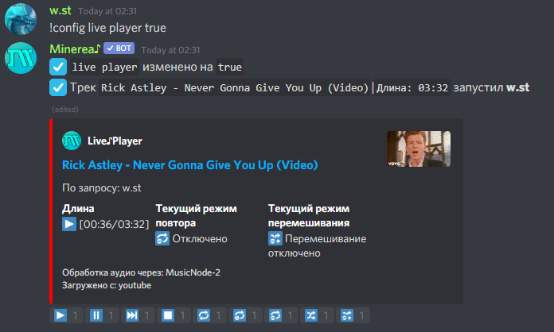

# Изменение конфигурации

## Изменение префикса

Префикс по умолчанию в Minerea `!` вы всегда можете поменять его на любой другой

Например

* !prefix `m!`

Теперь все команды работают с `m!`префиксом


Вы можете упомянуть Minerea и она покажет текущий префикс на вашем сервере



Команда help всегда может быть вызвана стандартным `!` префиксом


## Настройка языка

Minerea может говорить на многих языках, вот список поддерживаемых в настоящее время

* `en_US` — English \(Язык по умолчанию, если регион сервера не Россия\)
* `ru_RU` — Русский
* `cs_CZ` — Česky
* `it_IT` — Italiano

Например

* !lang `ru_RU`

Теперь все ответы на команды будут на Русском языке

## Настройка Live♪Player

Live♪Player предоставляют новый способ взаимодействия с ботом, вы можете управлять им с помощью реакций



!config `live player true`



!config `live player false`



## Настройка объявления трека

Объявление трека, показывает информацию о текущей воспроизводимой музыке при ее запуске



!config `track announce true`



!config `track announce false`



## Настройка автоматического возобновления

Автоматическое возобновление делает то что написано в названии, автоматически возобновляет текущий трек, когда кто-то присоединяется к каналу в котором бот



!config `auto resume true`



!config `auto resume false`



