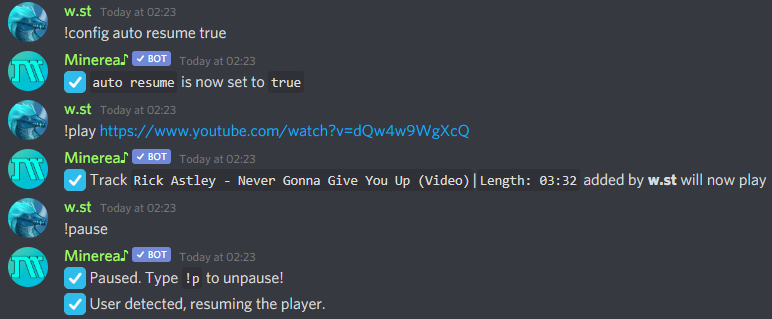

# Changing config

## Setting prefix

Default prefix in Minerea is `!` you can always change it to any other

For example

* !prefix `m!`

Now all commands works with `m!` prefix


You can mention Minerea and it show current prefix in your server



Help command always can be called through default `!` prefix


## Setting language

Minerea can speak on many languages, here list of currently supported

* `en_US` - English \(Default language if server region is not setted to Russia\)
* `ru_RU` - Русский
* `cs_CZ` - Česky
* `it_IT` - Italiano

For example

* !lang `en_US`

Now all responses to commands will be in English language

## Setting Live♪Player

Live♪Player provide new way to interact with bot, you can control it through reactions



!config `live player true`



!config `live player false`



## Setting track announce

Track announce setting showing info about current playing music when it starting



!config `track announce true`



!config `track announce false`



## Setting auto resume

Auto resume setting does what the title says, it automatically resuming current music when someone is joining channel where bot



!config `auto resume true`



!config `auto resume false`



